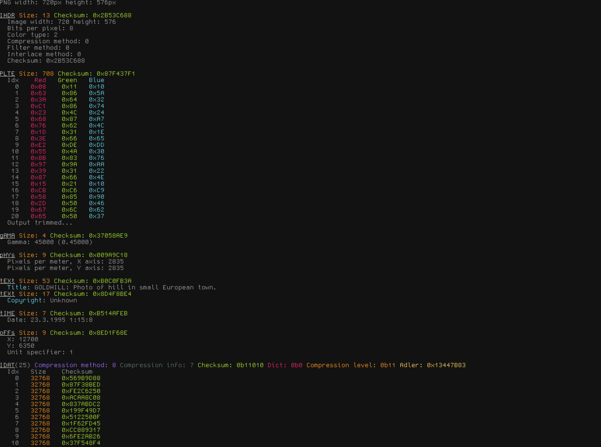

 
# Bininfo 
Get information about various binary file formats 

Warning: Error handling is very basic and hasn't been tested.

## Supported formats
- [x] BMP
- [x] PNG 1.2, PNGEXT 1.2
- [x] GIF
- [ ] JPG
- [ ] PDF
- [WIP] ELF
- [ ] PE

## Resources

### Bmp
- https://entropymine.com/jason/bmpsuite/

### Elf
- https://github.com/m4b/goblin

### Gif
- https://www.w3.org/Graphics/GIF/spec-gif89a.txt

### Png
- http://www.libpng.org/pub/png/pngsuite.html
- http://www.libpng.org/pub/png/png-sitemap.html#images

### Other
- https://github.com/corkami
